# Challenge 3: Observability and Monitoring for AI Agents

**Expected Duration:** 60 minutes

## Introduction
Welcome to Challenge 3! In this challenge, you'll implement comprehensive observability and monitoring for the Claims Processing Agent you built in Challenge 2. You'll learn how to instrument your AI agents with tracing, set up continuous evaluation, and monitor performance, quality, and safety in production using Microsoft Foundry's observability capabilities.

## What are we building?
In this challenge, we will create a complete observability and monitoring system for your AI agent:

- **Tracing Infrastructure**: OpenTelemetry-based tracing to track agent execution and tool calls
- **Azure Monitor Integration**: Application Insights connection for centralized telemetry collection
- **Continuous Evaluation**: Automated quality and safety assessment of production traffic
- **Observability Dashboard**: Real-time monitoring of agent performance metrics
- **Alert Configuration**: Proactive notification system for quality degradation or safety concerns
- **User Feedback Collection**: Mechanisms to capture and correlate user feedback with traces

This system enables you to maintain high-quality AI agent performance, quickly identify and resolve issues, and ensure safety and reliability in production environments.

## Why Observability for AI Agents?
AI agents require observability because they operate non-deterministically, making different decisions for the same input. Unlike traditional apps, you need monitoring to understand their decision-making, detect hallucinations/unsafe responses, and debug complex workflows. Microsoft Foundry provides distributed tracing to track each decision, tool call, and response while evaluating quality and safety metrics.

## The Evolution of Observability in the GenAI Era

Generative AI has transformed observability beyond traditional infrastructure metrics. AI systems require evaluation of response quality, not just performance.

**Key Differences:**
- **Quality over Status**: Measure response quality, relevance, and safety—not just "did it work"
- **Non-Deterministic Output**: Requires evaluation frameworks instead of assertion-based testing
- **Semantic Analysis**: Evaluate coherence, groundedness, and harmful content—not just HTTP codes
- **Decision Chain Tracing**: Track multi-step reasoning and tool calls across entire workflows
- **AI-Specific Risks**: Monitor for hallucinations, prompt injections, and harmful outputs in real-time

## Understanding Microsoft Foundry Observability

Microsoft Foundry provides a comprehensive observability platform specifically designed for AI applications and agents. It combines traditional application monitoring with AI-specific evaluation and safety capabilities.

### Core Components

**Tracing Infrastructure**
Built on OpenTelemetry standards, Microsoft Foundry tracing captures the complete execution flow of your AI agents:
- **Spans**: Individual operations (tool calls, model invocations, retrieval queries)
- **Traces**: Complete request-to-response journeys showing how agents orchestrate multiple operations
- **Attributes**: Rich contextual metadata including prompts, responses, tool parameters, and custom annotations
- **Semantic Conventions**: Standardized attribute naming for GenAI operations enabling cross-platform analysis

**Azure Monitor Application Insights Integration**
Seamless integration with Azure Monitor provides:
- Centralized telemetry collection and storage
- Long-term retention and historical analysis
- Advanced query capabilities with Kusto Query Language (KQL)
- Integration with existing Azure monitoring workflows and alerts
- End-to-end transaction views correlating AI operations with infrastructure metrics

## The Three Stages of GenAIOps Evaluation

Microsoft Foundry supports evaluation throughout the entire AI lifecycle:

### 1. Base Model Selection
Before building your application, evaluate different foundation models:
- Compare quality and accuracy across use cases
- Assess task-specific performance
- Evaluate safety profiles and bias characteristics
- Use Microsoft Foundry benchmarks or custom datasets

### 2. Preproduction Evaluation
Test your complete agent before deployment:
- **Manual Testing**: Playground evaluation with immediate metric feedback
- **Batch Evaluation**: Run comprehensive test suites against evaluation datasets
- **Adversarial Testing**: Use AI red teaming agent to simulate attacks and edge cases
- **Synthetic Data Generation**: Create realistic test scenarios when real data is limited
- **Evaluation Runs**: Track and compare results across agent iterations

### 3. Post-Production Monitoring
Continuous monitoring after deployment:
- **Continuous Evaluation**: Automated quality/safety assessment of sampled production traffic
- **Scheduled Evaluation**: Regular testing with fixed datasets to detect drift
- **Operational Metrics**: Track latency, throughput, error rates
- **User Feedback Integration**: Correlate subjective feedback with objective metrics
- **Alerting**: Proactive notifications when metrics fall below thresholds

This challenge focuses on implementing both pre-production and post-production evaluation and monitoring stages for your Claims Processing Agent using the Microsoft Foundry portal.

## Tasks

### Pre-Production Evaluation

Before deploying your agent to production, you'll evaluate its quality and safety using the Microsoft Foundry portal.

#### Task 1 - Preproduction Evaluation

1. Navigate to your AI Foundry project in the [new Microsoft Foundry portal](https://ai.azure.com/nextgen)
2. On the upper right part of your screen, click on **Build** 

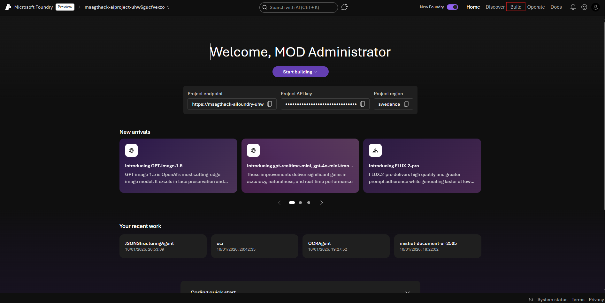

You should be able to see the 2 agents we've previously created on challenge-2.

3. Click on the **JSONStructuringAgent**. 

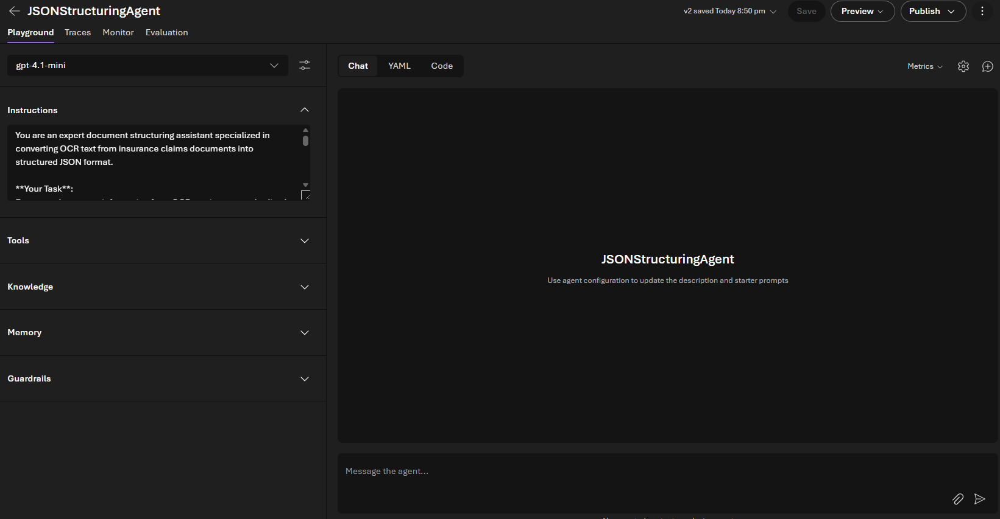

This is the new portal experience in Microsoft Foundry. On your left-hand side, you can see the model we chose to use, the meta-prompt we have given to this agent, and the ability to set all the capabilities we would want our agent to have:
- **Model:** Choose which underlying model the agent uses to generate responses.
- **Instructions:** Define the agent’s system prompt, role, and behavior guidelines.
- **Tools:** Configure external tools (APIs, functions) the agent can call during a conversation.
- **Knowledge:** Attach custom documents or data that the agent can reference as context.
- **Memory:** Enable and control how the agent stores and uses long‑term conversational memory.
- **Guardrails:** Set safety, compliance, and content rules that constrain the agent’s output using Azure AI Content Safety.

On the JsonStructuringAgent, we haven't set anything other than a prompt on how to structure the json. However, these tools, are very similar to the typical experience when creating agents. It's the other tabs that bring the best experience to the New Foundry Portal.

4. Click on the **Traces** Tab

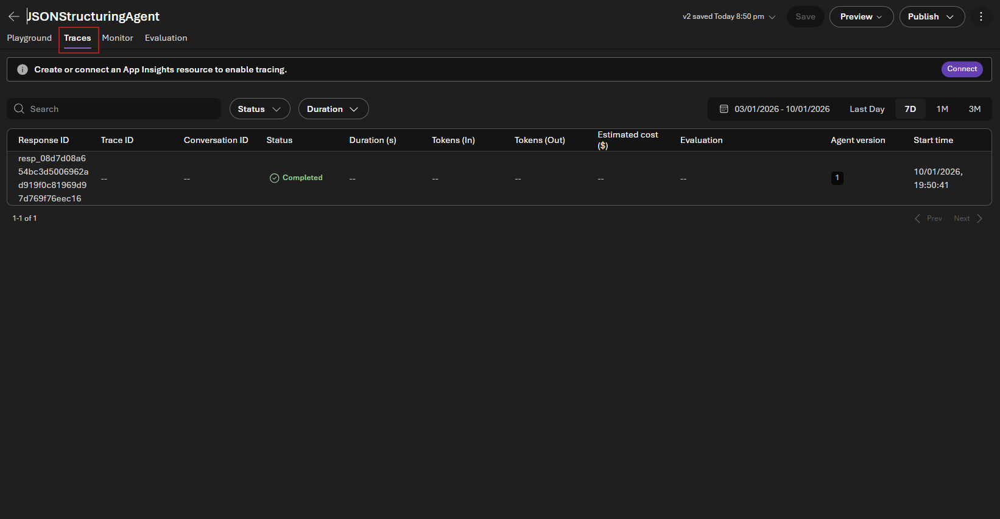

Portal traces are useful for development—showing execution flow, tool calls, and performance bottlenecks. However, they lack long-term retention, analytics, alerting, and scalability for production.

**Connecting to Application Insights** provides:
- Long-term trace storage and KQL querying
- Automated alerting and cross-service correlation
- Performance dashboards and cost analysis
- Compliance audit trails

Integrate now to establish observability before production deployment.

5. Let's set up this integration. On the upper right hand part of your screen, click on the purple **Connect** button.
6. From the drop down menu, select your **Application Insights Resouce** and select the Application Insights resource that was created during your initial deployment.

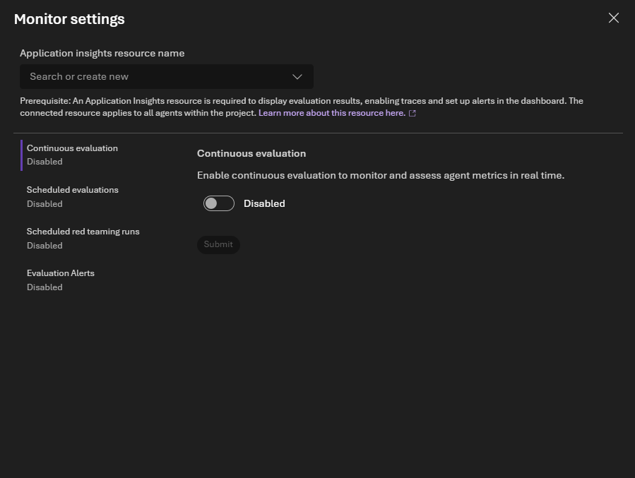

7. The new Microsoft Foundry experience has provided easy access to configure the most advanced monitoring options for your agents. Let's explore them one by one. For more information, please have a look at the [documentation](https://learn.microsoft.com/en-us/azure/ai-foundry/concepts/observability?view=foundry) provided on the official Microsoft Learn website.

7.1 **Continuous Evaluation**: Automatically evaluates a configurable percentage of live production traffic in real-time, assessing quality metrics (groundedness, relevance, coherence) and safety metrics (content safety across all categories). This provides ongoing visibility into agent performance without manual review.

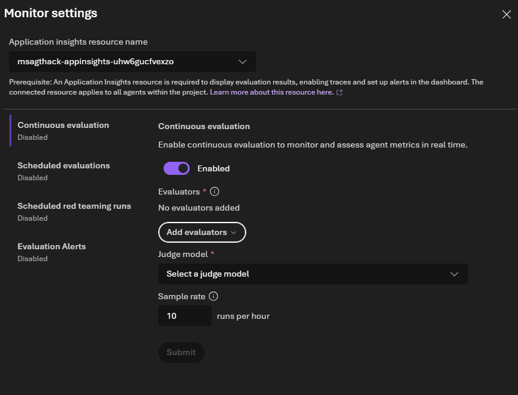

Let's toggle the Continuous Evaluation Part (CI). Let's click on **Add Evaluators**. The evaluation of modern Agent systems can be divided into 5 main buckets: 
1. General Purpose Evaluators - AI systems might generate textual responses that are incoherent, or lack the general writing quality beyond minimum grammatical correctness
2. Textual Similarity Evaluators: ompare how closely the textual response generated by your AI system matches the response you would expect
3. Retrieval-Augmented Generation (RAG) evaluators: measuring retrieval quality, groundedness, relevance, and response completeness in RAG-based generative AI systems, including when and how to use each one.
4. Risk and safety Evaluators: These evaluators use language models to detect safety risks in AI responses, such as sexual or violent content.
5. Agent Evaluators: Agent evaluators provide systematic observability into agentic workflows by measuring quality, safety, and performance.
6. We can also add a 6th bucket that is how we define evaluators for specific use cases. For this task, we can also create [Custom Evaluators](https://learn.microsoft.com/en-us/azure/ai-foundry/concepts/evaluation-evaluators/custom-evaluators?view=foundry)

For this exercise, let's choose the following parameters:

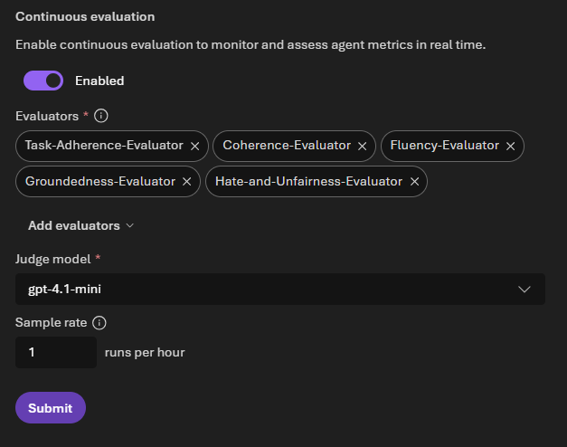

7.2  **Scheduled Evaluations**: Runs periodic evaluations against a fixed benchmark dataset on your chosen schedule to detect model drift or performance degradation over time by comparing against consistent baseline data.

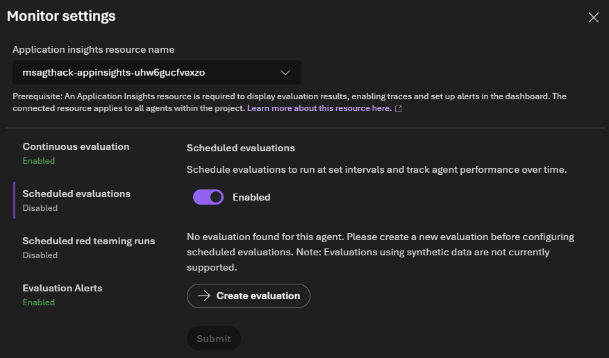

Let's toggle the Enable **Schedule Evaluation** for our Agent

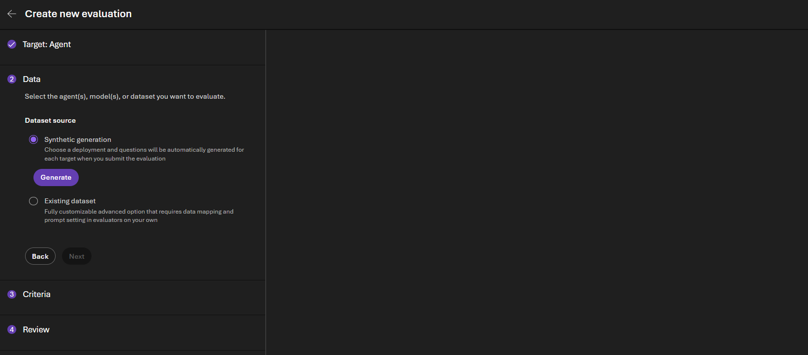

For enterprise-grade evaluations, experts in the domain in which the agents are working on should provide a set of pairs of question and answers to provide the query and groun truth to which to compare the agent's response to. As of this moment, we don't have this dataset. 

1. So, we can use Microsoft's Foundry Synthetic Generation button to generate this dataset for us. 
2. Let's add the **ground-truth.json** file as a seed data, and leave all other values by default.
3. On the criteria section, you will be suggested 18 evaluators for this agent. Let's leave that by default and click on next and then click on **Submit**.

This step will look at the original data, look at the agent prompt and generate synthetic data to run against this agent, and then will run this synthetic data agaisnt the 18 evaluators we have set. This should take some minutes. Meanwhile, let's explore the other two options we have for monitoring:

7.3 **Scheduled Red Teaming Runs**: Executes automated adversarial security testing on a regular basis using PyRIT (Python Risk Identification Toolkit) to proactively identify vulnerabilities such as jailbreak attempts, prompt injections, and other attack vectors.

7.4 **Evaluation Alerts**: Configures automated notifications when quality or safety metrics fall below your defined thresholds (e.g., alert when groundedness drops below 75%), enabling proactive issue detection and rapid response.

Let's explore the Evaluation Alerts in the following section.

### Post-Production Monitoring

At this point, we have ensured this Agent has a Continuous Evaluation to monitor and assess agent metrics. Let's go back to the Monitoring section of our agent. Click on the highlighted button to go back to the main section. 

And then click on the Monitor section:

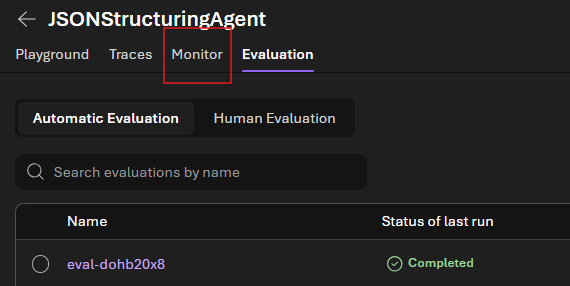

Now, we are able to see the Microsoft Foundry Observability dashboard that provides a centralized view of your agent's health and performance:

| Category | Features | Purpose |
|----------|----------|---------|
| **Real-Time Observability** | Cost tracking, token consumption, resource utilization, quality evaluations (coherence, fluency, task adherence, relevance, groundedness), pass/fail rate indicators | Monitor agent performance and resource usage in real-time |
| **Evaluation Capabilities** | Continuous evaluation of production traffic, scheduled evaluations against benchmarks, red teaming security assessments | Ensure quality, detect drift, and identify vulnerabilities |
| **Analytics & Visualization** | Time-series charts, customizable date ranges, dual-axis metrics, trend analysis | Track performance patterns and correlate multiple metrics over time |
| **Intelligent Insights** | Ask AI assistant for natural language queries, drill-down to trace details, Azure Monitor integration for KQL queries | Investigate anomalies and get actionable recommendations |
| **Actionable Intelligence** | Cost optimization insights, quality degradation detection, performance tracking (latency, throughput, errors) | Proactively identify and resolve issues before user impact |

This dashboard, will look something like this:

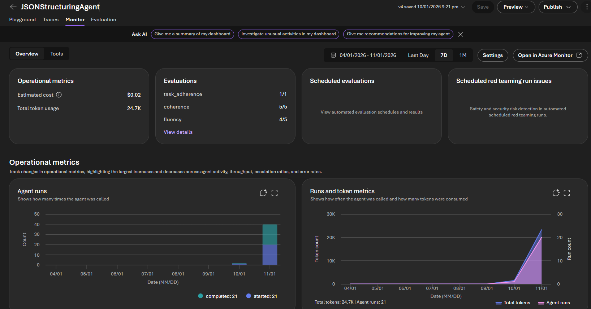

If you scroll down, you can check the details of all this runs. Now, we have one more step left: **Create evaluation alerts.**

Let's click on **Settings** on the upper right part of our screen.

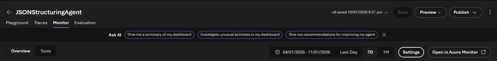

Let's check our evaluation alerts section and toggle the **Enabled** button. 

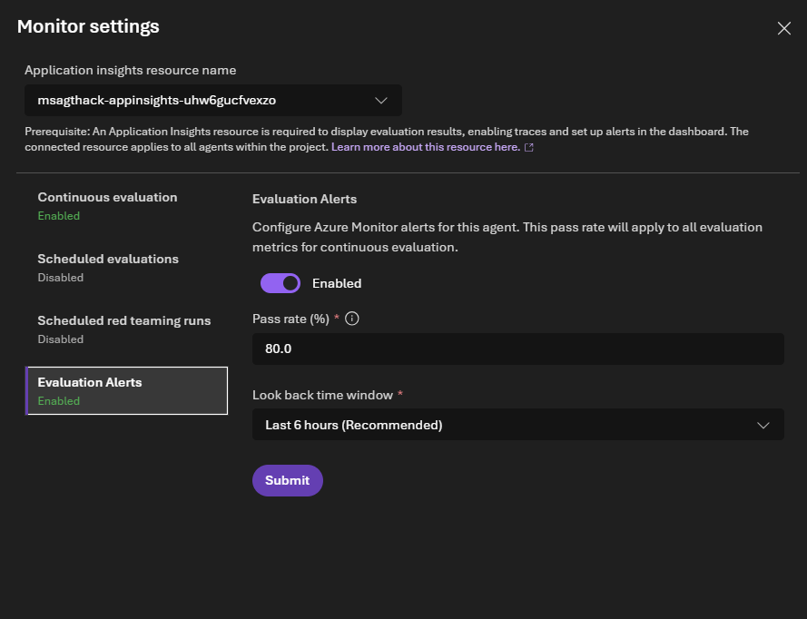

This will run the 5 metrics we have defined on the Continuous Evaluation section and ensure we have a recurring 80% success on this metrics. If that doesn't happen, alerts will arise to make sure the Developers have a look at the quality and security of the agent in Production.

#### Programmatic Configuration with the Microsoft Foundry SDK

While the portal provides an intuitive interface for configuring observability and monitoring, all of these capabilities can also be configured programmatically using the **Microsoft Foundry SDK**. This enables Infrastructure as Code (IaC) approaches, CI/CD integration, and automated agent deployment pipelines.

This programmatic approach is particularly valuable for teams practicing GitOps, managing multiple agents across environments, or building custom monitoring workflows. Some of the examples are on [Running Agent Evaluations on the SDK](https://learn.microsoft.com/en-us/azure/ai-foundry/how-to/develop/cloud-evaluation?view=foundry&tabs=python) and [Running AI Red Teaming Agents](https://learn.microsoft.com/en-us/azure/ai-foundry/how-to/develop/run-ai-red-teaming-cloud?view=foundry&tabs=python).

For detailed SDK documentation and code examples, refer to the [Microsoft Foundry SDK documentation](https://learn.microsoft.com/en-us/azure/ai-foundry/how-to/develop/sdk-overview).

## 🎯 Conclusion

Congratulations! You've successfully implemented comprehensive observability and monitoring for your Claims Processing Agent. Your system now provides deep visibility into agent behavior, automated quality and safety evaluation, and proactive alerting capabilities.

